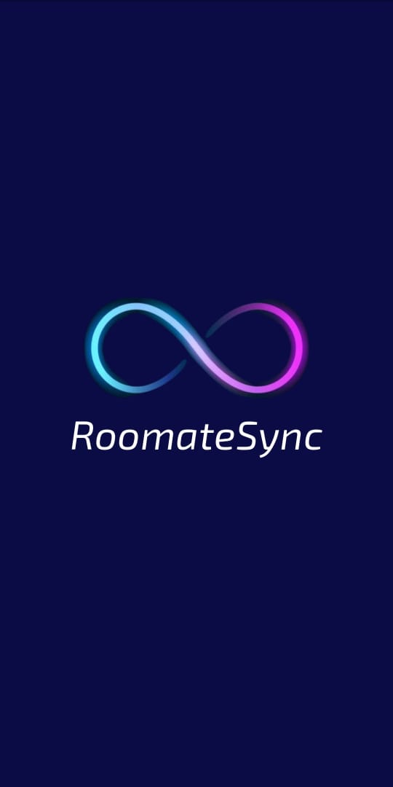
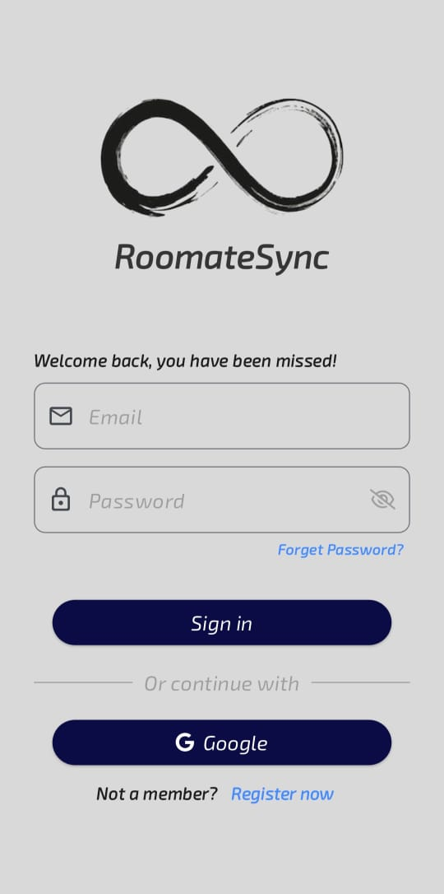
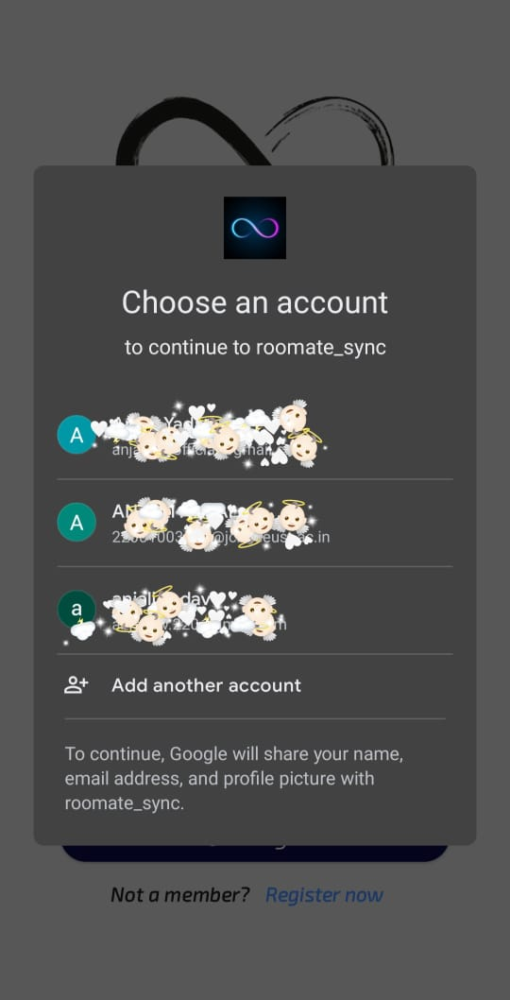
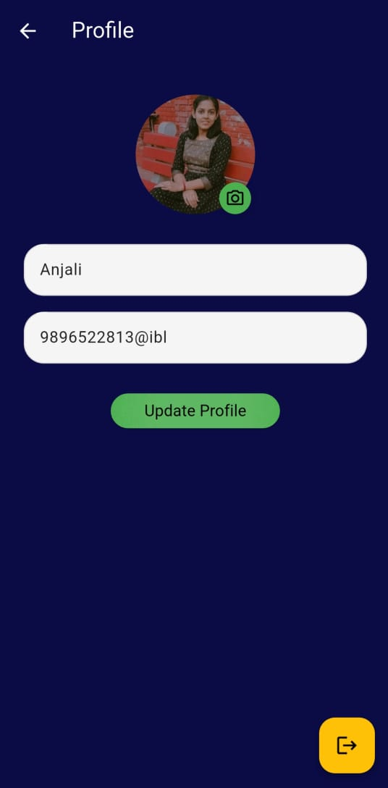
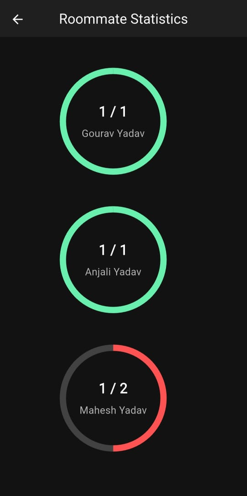
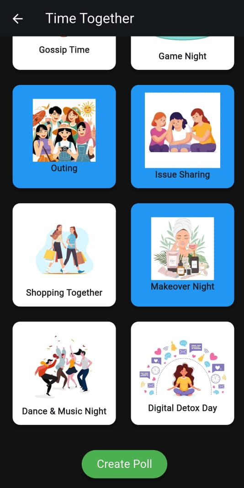
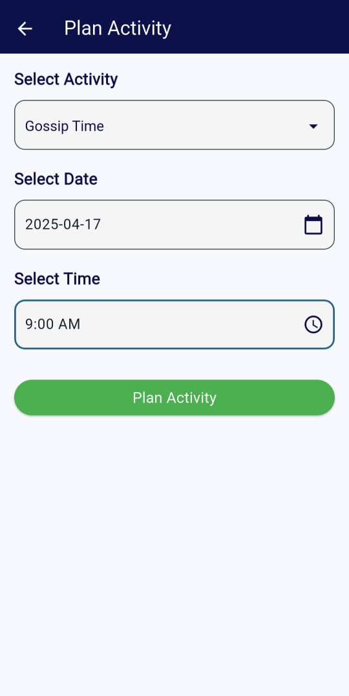
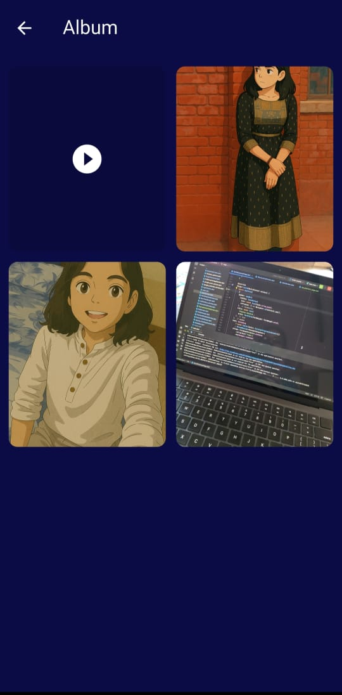

# 🏡 RoommateSync – Smart Living Companion App

**RoommateSync** is a Flutter-based mobile application designed to streamline shared living. It simplifies roommate coordination by combining task management, expense tracking, activity planning, and seamless communication—all in one place.

---

## ✨ Key Features

### ✅ Task Management
- Assign and track tasks.
- Mark tasks as complete with real-time updates.
- Get notifications on task assignments and deadlines.
- Automatic deletion of tasks upon completion or deadline expiry.

### 💸 Expense Management
- Split expenses among selected roommates.
- Drop-down roommate selector with individual due amount display.

### 🔔 Notifications
- Smart alerts for:
  - Task assignments and deadlines.
  - Polls and planned activities.
  - Deadline reminders.

### 🗳️ Polls & Activity Planning
- Create and vote on activities (e.g., movie nights, game sessions).
- "Plan Activity" button for manual or poll-based scheduling.

### 📷 In-App Gallery
- Capture and upload photos and videos.
- Store and retrieve images and videos from Firebase.
- Personal or group album support.

### 📊 Statistics Dashboard
- Visual insights of assigned tasks and completed tasks.

---

## 🚀 Tech Stack

- **Frontend**: Flutter
- **Backend**: Firebase (Auth, Firestore, Storage, FCM)
- **Notifications**: Firebase Cloud Messaging
- **Payments**: Cashfree UPI Gateway
- **State Management**: Provider (or your chosen state manager)
- **Other**: Markdown, GitHub Actions (optional CI)

---

## 🧩 Planned Features

### 💳 UPI Payment Integration
- Seamless expense settlement using **Cashfree UPI Gateway**.
- Direct redirection to UPI apps (e.g., PhonePe, GPay) with pre-filled UPI ID and amount.
- Automatically updates balances and marks shares as settled.
- Removes the need for manual confirmation.
- Smart notifications for pending payments.

## 📷 App Screenshots

  
  
  
.jpeg)  
.jpeg)  
  
.jpeg)  
.jpeg)  
  
.jpeg)  
.jpeg)  
  
.jpeg)  
.jpeg)  
  
.jpeg)  
.jpeg)  
  
.jpeg)  
  
.jpeg)  
.jpeg)  
  
.jpeg)

---

## 🛠️ Setup Instructions

1. Clone the repository:
   ```bash
   git clone https://github.com/AnjaliKhosya/RoommateSync.git
   cd RoommateSync
